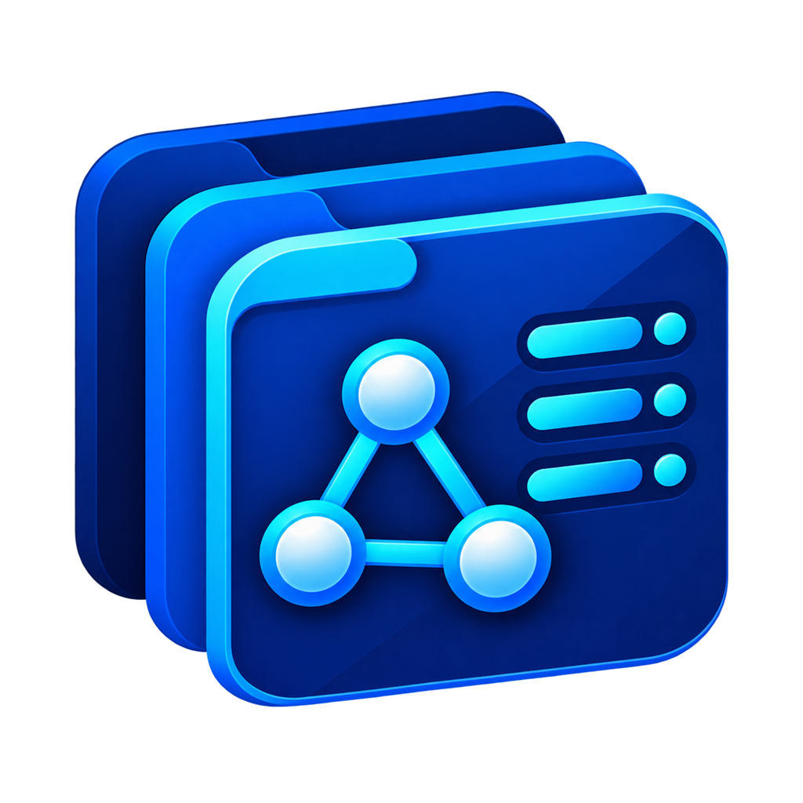
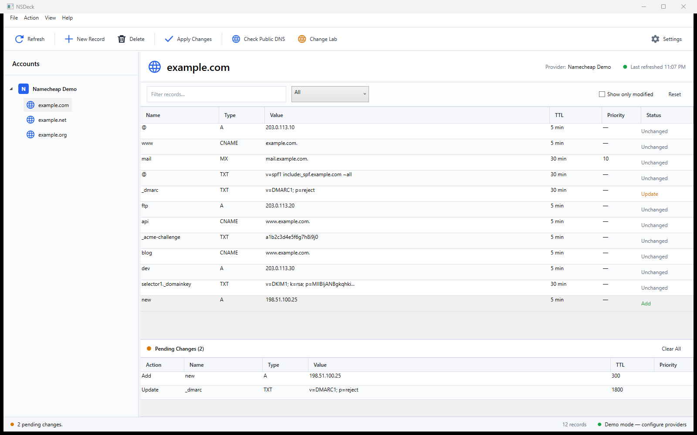

<p align="center">
  
</p>

# NSDeck

**Every zone. One deck.**

**A Quantex Secure product.**

[](LICENSE)


NSDeck is a .NET 10 WPF administration console for managing public and private DNS across multiple providers. Its provider-and-zone tree follows the familiar workflow of Microsoft DNS Manager, while its guarded apply process protects against stale edits and keeps a pre-change snapshot.



## Supported providers

- Namecheap BasicDNS
- Microsoft Azure DNS
- GoDaddy DNS
- Cloudflare DNS
- AWS Route 53
- Google Cloud DNS
- Microsoft Windows DNS Server through a constrained JEA endpoint

PowerDNS is intentionally not included yet.

## Current features

- Loads public zones from every enabled provider into one account tree.
- Shows only Namecheap domains whose zones are hosted by Namecheap BasicDNS or PremiumDNS; externally delegated registrations remain hidden from the Namecheap node.
- Provides an in-app setup checklist and official documentation link on every provider tab.
- Reads and edits common A, AAAA, CAA, CNAME, MX, NS delegation, PTR, SRV, and TXT records.
- Connects to Windows DNS without storing Domain Admin credentials; the current Windows identity is limited by a server-side JEA role and every remote command is transcribed.
- Filters records by text and record type.
- Supports Ctrl-click and Shift-click multi-selection so several records can be staged for deletion together.
- Stages add, edit, and delete operations locally.
- Searches records globally across every configured provider and zone in the DNS Change Lab.
- Builds coordinated multi-zone find-and-replace plans with dependency and shared-value analysis.
- Snapshots every affected zone, applies the plan, verifies each provider, and rolls completed zones back if the transaction fails.
- Reviews dangerous MX, apex, SPF, DKIM, DMARC, CAA, NS, and bulk-deletion changes before applying.
- Re-reads the provider before applying and stops if something else changed the zone.
- Saves a DPAPI-protected provider configuration and a local pre-change zone snapshot.
- Applies provider-appropriate changes and then retries verification for up to 30 seconds while provider control planes settle.
- Uses Azure DNS record-set ETags to block last-moment concurrent overwrites.
- Checks expected records through Cloudflare and Google public resolvers with an auto-refreshing propagation radar.
- Writes credential-free local JSON audit logs and exports public-safe diagnostic ZIP reports with zone names, Windows server names, fingerprints, and provider details anonymized.
- Supports automatic HTTPS update checks with user-confirmed downloads; silent installation stays disabled until releases are signed.
- Exports, imports, and stages JSON zone snapshots.
- Uses safe sample data when no provider is enabled.

Provider-managed apex SOA and NS records are intentionally hidden from the editable record grid. Route 53 alias and policy-based records and Google routing-policy record sets are left untouched by the basic record editor.

## Running

Download the latest Windows package from the repository's **Releases** page once binary releases are published. Verify the accompanying SHA-256 checksum before running it. Until Quantex Secure publishes Authenticode-signed builds, Windows may display an unknown-publisher warning.

To run from source:

```powershell
dotnet run --project .\src\NSDeck.Desktop\NSDeck.Desktop.csproj
```

The solution targets `net10.0-windows` and builds with the .NET 10 SDK.

## Connecting providers

Open **File → DNS Provider Accounts** and enable any combination of providers.

- **Namecheap:** API user, username, API key, and whitelisted public IPv4 address.
- **Azure DNS:** subscription ID. Use an existing Azure CLI, Visual Studio, or environment sign-in, or provide a tenant ID, application ID, and client secret.
- **GoDaddy:** Personal Access Token with domain read and DNS update scopes.
- **Cloudflare:** scoped API token with Zone Read, DNS Read, and DNS Edit.
- **Route 53:** IAM access key and secret with hosted-zone list/read/change permissions. Temporary session tokens are supported.
- **Google Cloud DNS:** project ID plus a service-account JSON file, or Application Default Credentials.
- **Windows DNS:** one or more DNS server names and the default `NSDeck.Dns` JEA endpoint. The Windows DNS tab exports the one-time server setup script and tests the constrained connection using the current Windows account.

All provider configuration—including identifiers and secrets—is serialized into one payload encrypted with Windows DPAPI. It can be decrypted only by the same Windows account on the same computer.

When NSDeck starts for the first time, it copies existing settings, snapshots, and audit logs from the former `%LOCALAPPDATA%\DomainDnsManager` folder into `%LOCALAPPDATA%\NSDeck`. The original folder is retained as a rollback copy. A saved legacy Windows DNS endpoint name is upgraded to `NSDeck.Dns` in memory.

## Safe update behavior

Every save follows the same guarded workflow:

1. Read and fingerprint the original editable records.
2. Stage changes locally.
3. Validate the intended records.
4. Re-read the provider and stop if the zone changed.
5. Save a pre-change snapshot.
6. Apply the provider-specific change set.
7. Re-read and verify the resulting fingerprint, retrying for up to 30 seconds before warning that the update may still be propagating.

Namecheap and GoDaddy use complete editable-record replacement. Azure, Cloudflare, Route 53, and Google Cloud DNS use record-set or record-level changes. Provider-managed and advanced routing records are not deleted by this process.

Windows DNS reads and reconciles A, AAAA, CNAME, MX, NS, PTR, SRV, and TXT records through three purpose-built JEA functions. SOA, DNSSEC, CAA, and other record types remain untouched and are not exposed for editing by this provider.

## Windows DNS least-privilege setup

The desktop application never needs to run as a Domain Admin. In **Settings → Windows DNS**, save `Install-NSDeckJea.ps1`, copy it to each DNS server, and run it once from an elevated Windows PowerShell 5.1 session using a privileged setup identity:

```powershell
.\Install-NSDeckJea.ps1 -OperatorGroup 'CONTOSO\NSDeck-DnsOperators'
```

When run without `-OperatorGroup`, the script now prompts for the group and offers `USERDOMAIN\NSDeck-DnsOperators` as the default when the current account is signed into a domain.

Windows DNS servers are treated as internal by default, so NSDeck does not offer public-resolver propagation checks for their zones. Enable **These Windows DNS servers host public authoritative zones** only when the configured servers genuinely publish those zones to the internet.

Create the operator group and add the intended users before running the script. The script installs a restricted endpoint named `NSDeck.Dns`, exposes only the application's zone-list, record-read, and record-reconciliation functions, uses a temporary virtual account for those functions, and writes JEA transcripts beneath `%ProgramData%\NSDeck\JEA-Transcripts`. Sign out and back in after changing group membership.

The installer removes the pre-release `DomainDnsManager.Dns` endpoint and module when found. Use `-KeepLegacyEndpoint` only when an older application build must remain operational during a staged migration.

To remove the endpoint and its module later:

```powershell
.\Install-NSDeckJea.ps1 -Remove
```

Namecheap's harmless one-second TTL drift and its placeholder priority on non-MX records are normalized before verification so they do not create false mismatch warnings.

## DNS Change Lab

Open **Action → DNS Change Lab** to build one guarded change across multiple providers and domains:

1. Refresh the global inventory.
2. Search by provider, domain, record name, type, IP address, or target.
3. Select all matching records and review the blast-radius tree.
4. Enter the text to find and its replacement, then add the selected records to the coordinated plan.
5. Review the complete before/after table and apply it.

The Change Lab re-reads every affected zone before writing anything. If all preflight checks pass, it saves every snapshot, applies and verifies the zones sequentially, and restores already-written zones in reverse order if a later provider fails. After a successful transaction, the propagation radar opens with every changed record.

Public resolver results are informational. Cloudflare or Google can continue returning a cached prior value until that value's old TTL expires even though the authoritative provider has already verified the update.

## Tests

```powershell
dotnet test .\NSDeck.slnx
```

The automated tests do not contact live DNS accounts. Live verification requires credentials supplied by the account owner.

The GitHub Actions workflow runs the public-source scan, Windows PowerShell 5.1 JEA compatibility test, Release build, and automated test suite on every pull request.

## Release packaging

`build-release.ps1` runs the tests and produces a versioned executable, ZIP archive, and SHA-256 checksum. If Inno Setup is installed, it also builds the per-user Windows installer. Authenticode signing is supported when a certificate thumbprint is supplied; see `docs\RELEASE.md`.

Before publishing the repository or a GitHub release, follow [the public release checklist](docs/PUBLIC_RELEASE.md). The release build runs a generic secret and local-path scan. Organization-specific blocked terms can be supplied through `-BlockedTerms` or an ignored local `.public-release-blocked-terms.txt` file.

## Security and support

Do not report vulnerabilities or expose production DNS data in public issues. Follow [SECURITY.md](SECURITY.md) for private vulnerability reporting and [SUPPORT.md](SUPPORT.md) for safe diagnostic guidance. NSDeck can make authoritative DNS changes; review staged changes and retain independent recovery access to every provider.

## Contributing

Contributions are welcome. Read [CONTRIBUTING.md](CONTRIBUTING.md) before opening a pull request and follow the [Code of Conduct](CODE_OF_CONDUCT.md). Tests and examples must use reserved domains, addresses, and sanitized provider data.

Release history is maintained in [CHANGELOG.md](CHANGELOG.md). Maintainers preparing the first public repository should follow [docs/GITHUB_SETUP.md](docs/GITHUB_SETUP.md).

## License

Copyright © 2026 Quantex Secure. NSDeck is licensed under [Apache License 2.0](LICENSE). Third-party components remain under their respective licenses; see [THIRD-PARTY-NOTICES.md](THIRD-PARTY-NOTICES.md).

## Current limitations

- The executable is unsigned, so Windows may show an unrecognized-publisher warning.
- Live provider calls are not part of the automated build because credentials are deliberately excluded.
- Cloudflare proxy state is preserved when existing records are patched; newly created records default to DNS-only.
- Advanced Route 53 aliases/routing policies and Google routing-policy records remain untouched and require their provider consoles.
- DNSSEC configuration and registrar nameserver changes are outside the record editor.
- Silent update installation remains disabled until a trusted code-signing certificate is configured; HTTPS version checks and user-confirmed downloads are supported.

## Project layout

```text
src/NSDeck.Core                 DNS models, validation, comparison, snapshots
src/NSDeck.Providers.Namecheap Namecheap API provider
src/NSDeck.Providers.Cloud     Azure, GoDaddy, Cloudflare, Route 53, Google
src/NSDeck.Providers.Windows   Windows DNS through PowerShell JEA
src/NSDeck.Desktop             .NET 10 WPF application
tests/NSDeck.Tests             Automated safety and provider tests
design/                        Sanitized interface preview
.github/                       CI and community health files
```
